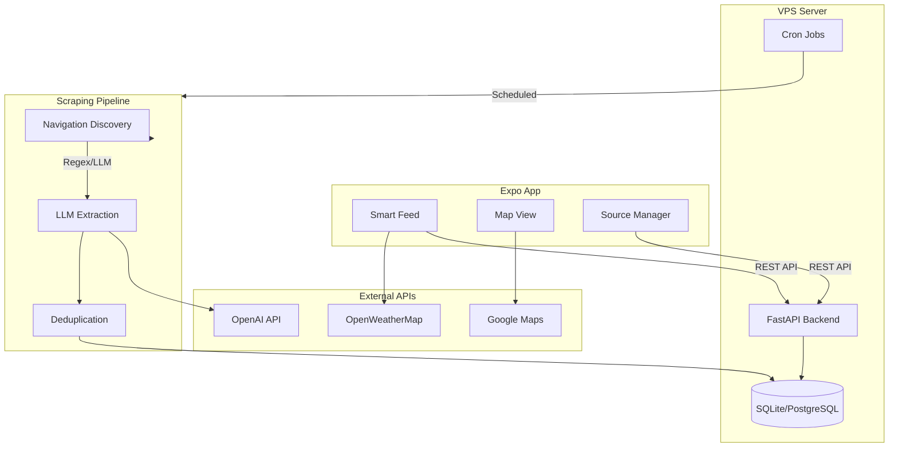

# ahoi - Implementierungsplan

**App-Name:** ahoi (familienfreundlicher Event-Aggregator für Hamburg)

## Hosting-Strategie

**Backend wird auf eigenem VPS gehostet** - kein Firebase, keine Cloud Functions.

- **Datenbank:** SQLite (einfach) oder PostgreSQL (skalierbar)
- **Backend:** FastAPI (Python)
- **Scraping:** Cron Jobs auf dem VPS
- **Frontend:** Expo App kommuniziert via REST API

## Architektur-Übersicht



---

## Phase 1: Lokales Scraping-Prototyping (Python)

**Ziel:** Scraping-Qualität validieren, bevor wir Firebase einbinden.

### 1.1 Projekt-Setup

- Ordnerstruktur:
  ```
  /backend
    /scraper
      __init__.py
      navigator.py      # Stage 1: URL Discovery
      extractor.py      # Stage 2: LLM Extraction
      deduplicator.py   # Stage 3: Hash + Dedup
      models.py         # Pydantic Models
    /tests
      test_sources/     # HTML Snapshots für Tests
    requirements.txt
    .env.example
  ```
- Dependencies: `playwright`, `beautifulsoup4`, `openai`, `pydantic`, `python-dotenv`, `markdownify`

### 1.2 Navigation Discovery (navigator.py)

- **Attempt A:** Regex-basierte Suche nach Keywords in `<a>` Tags:
  - Keywords: `["spielplan", "programm", "kalender", "termine", "veranstaltungen", "events"]`
- **Attempt B:** LLM-Fallback mit minimiertem HTML (nur `<nav>`, `<header>`, `<footer>`)
- Output: `target_url` oder `None`

### 1.3 LLM Extraction (extractor.py)

- HTML zu Markdown konvertieren (Token-Reduktion)
- Structured Output mit JSON Schema für Events
- Prompt enthält Filterlogik: "Ist dieses Event für Kinder ab 4 Jahren geeignet?"
- Kategorien-Mapping auf: `theater | outdoor | museum | music | sport | market`

### 1.4 Lokales Testing

- 3-5 echte Hamburger Quellen testen (manuell URLs bereitstellen)
- Erfolgsrate und Datenqualität dokumentieren
- Kosten pro Scrape messen (Token-Verbrauch)

---

## Phase 2: Backend API Setup (VPS)

### 2.1 Datenbank-Schema

**Tabelle: `sources`**

```sql
CREATE TABLE sources (
    id TEXT PRIMARY KEY,
    name TEXT NOT NULL,
    input_url TEXT NOT NULL,
    target_url TEXT,
    is_active BOOLEAN DEFAULT TRUE,
    status TEXT DEFAULT 'pending',  -- 'active' | 'error' | 'pending'
    last_scraped TIMESTAMP,
    last_error TEXT,
    strategy TEXT DEFAULT 'weekly',  -- 'weekly' | 'monthly'
    region TEXT DEFAULT 'hamburg',
    created_at TIMESTAMP DEFAULT CURRENT_TIMESTAMP
);
```

**Tabelle: `events`**

```sql
CREATE TABLE events (
    id TEXT PRIMARY KEY,  -- Hash
    source_id TEXT REFERENCES sources(id),
    title TEXT NOT NULL,
    description TEXT,
    date_start TIMESTAMP NOT NULL,
    date_end TIMESTAMP,
    location_name TEXT,
    location_address TEXT,
    location_lat REAL,
    location_lng REAL,
    category TEXT,  -- 'theater' | 'outdoor' | 'museum' | 'music' | 'sport' | 'market'
    is_indoor BOOLEAN,
    age_suitability TEXT,
    price_info TEXT,
    original_link TEXT,
    region TEXT DEFAULT 'hamburg',
    created_at TIMESTAMP DEFAULT CURRENT_TIMESTAMP,
    updated_at TIMESTAMP DEFAULT CURRENT_TIMESTAMP
);

CREATE INDEX idx_events_region_date ON events(region, date_start);
CREATE INDEX idx_events_category ON events(region, category, date_start);
```

### 2.2 FastAPI Endpoints

| Endpoint | Method | Beschreibung |
|----------|--------|--------------|
| `/api/events` | GET | Events abrufen (mit Filtern) |
| `/api/events/{id}` | GET | Einzelnes Event |
| `/api/sources` | GET | Alle Quellen |
| `/api/sources` | POST | Neue Quelle hinzufügen |
| `/api/sources/{id}/scrape` | POST | Quelle manuell scrapen |
| `/api/health` | GET | Health Check |

### 2.3 Cron Jobs (auf VPS)

```bash
# /etc/cron.d/ahoi
# Wöchentliches Scraping aller Quellen (Sonntag 3:00 Uhr)
0 3 * * 0 ahoi /opt/ahoi/venv/bin/python /opt/ahoi/scrape_all.py

# Tägliche Bereinigung alter Events (4:00 Uhr)
0 4 * * * ahoi /opt/ahoi/venv/bin/python /opt/ahoi/cleanup.py
```

### 2.4 Deployment-Struktur auf VPS

```
/opt/ahoi/
  venv/                 # Python Virtual Environment
  backend/
    main.py             # FastAPI App
    database.py         # SQLite/PostgreSQL Connection
    scraper/            # Scraping-Code aus Phase 1
  data/
    ahoi.db             # SQLite Datenbank
  scrape_all.py         # Cron Script
  cleanup.py            # Cleanup Script
  .env                  # Secrets (OPENAI_API_KEY, etc.)
```

### 2.5 Secrets Management

- `.env` Datei auf dem VPS (nicht im Git!)
- Enthält: `OPENAI_API_KEY`, `DATABASE_URL`

---

## Phase 3: Expo Frontend

### 3.1 Projekt-Setup

- `npx create-expo-app@latest ahoi --template tabs`
- NativeWind konfigurieren
- Expo Router (bereits in Template)
- REST API Client (fetch / axios)

### 3.2 Screens

**Smart Feed (`/app/(tabs)/index.tsx`)**

- FlashList für Performance
- Filter-Bar: "Dieses Wochenende", "Indoor", "Max. Entfernung"
- Pull-to-refresh
- Event-Card mit: Titel, Datum, Ort, Kategorie-Icon, Preis

**Map View (`/app/(tabs)/map.tsx`)**

- `react-native-maps` mit Event-Pins
- Cluster bei vielen Events
- Bottom Sheet für Event-Details

**Source Manager (`/app/(tabs)/sources.tsx`)**

- URL-Input mit Validierung
- Liste der Quellen mit Status-Dot (grün/rot/gelb)
- Manueller "Jetzt scrapen" Button pro Quelle

### 3.3 UI/Design

- Lucide Icons für Kategorien:
  - Theater: `Drama` / Outdoor: `TreePine` / Museum: `Landmark` / Music: `Music` / Sport: `Medal` / Market: `ShoppingBag`
- Farbpalette: Weiche, familienfreundliche Farben mit gutem Kontrast
- Dark Mode Support von Anfang an

---

## Phase 4: Testing & Polish

- End-to-End Test: URL hinzufügen -> Scrapen -> Event im Feed
- Error Handling: Was passiert bei fehlgeschlagenem Scrape?
- Rate Limiting für LLM-Calls
- Monitoring: Logging auf VPS (journalctl, Logfiles)
